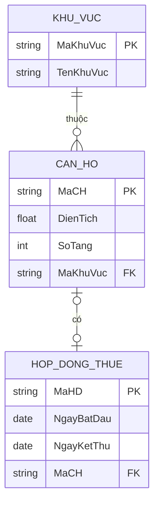

# BÁO CÁO THỰC HÀNH THIẾT KẾ ERD QUẢN LÝ CĂN HỘ CHO THUÊ - RIKKEIREALTY

> 👤 **Học viên:** Đỗ Hoàng Sơn | **Mã SV:** PTIT-HCM-066
> 🏫 **Môn học:** IT105-K25-Phan-tich-thi-t-k-h-th-ng

---

## 📊 Sơ đồ thiết kế hệ thống (Class Diagram)

> 💡 *Sơ đồ dưới đây được render tự động trực tiếp trên GitHub bằng Mermaid. Bạn cũng có thể tải file **`bt3.drawio`** trong repository này để mở và chỉnh sửa trực tiếp trên [Draw.io (diagrams.net)](https://app.diagrams.net).* 

---

## Nhiệm vụ 1: Xác định Entity, Attribute và Khóa chính

Sau khi phân tích yêu cầu nghiệp vụ của sàn giao dịch bất động sản RikkeiRealty cho phân hệ Quản lý căn hộ cho thuê, tôi đã hoàn thiện danh sách các thực thể (Entity) cùng thuộc tính (Attribute) và khóa chính (Primary Key) tương ứng như sau.

- Entity CAN_HO: Lưu trữ thông tin chi tiết từng căn hộ thuộc sàn giao dịch.
- Entity HOP_DONG_THUE: Theo dõi thông tin hợp đồng thuê căn hộ hiệu lực.
- Entity KHU_VUC: Phân loại căn hộ theo từng khu vực địa lý cụ thể.

| Entity | Attribute cần lưu | Khóa chính (PK) đề xuất |
| --- | --- | --- |
| CAN_HO | MaCH, DienTich, SoTang | MaCH |
| HOP_DONG_THUE | MaHD, NgayBatDau, NgayKetThuc | MaHD |
| KHU_VUC | MaKhuVuc, TenKhuVuc | MaKhuVuc |

## Nhiệm vụ 2: Thiết kế quan hệ và Khóa ngoại

Trong phần này, tôi tiến hành xây dựng sơ đồ thực thể kết hợp (ERD) với hai loại quan hệ cốt lõi theo đúng yêu cầu đề bài, đảm bảo tính toàn vẹn tham chiếu cho cơ sở dữ liệu.

- Quan hệ giữa Khu vực và CAN_HO (1 - N): Một khu vực có thể chứa nhiều căn hộ hoặc chưa có căn hộ nào, nhưng mỗi căn hộ bắt buộc phải thuộc về đúng một khu vực duy nhất. Khóa ngoại 'MaKhuVuc' được đặt vào bảng CAN_HO.
- Quan hệ giữa CAN_HO và HOP_DONG_THUE (1 - 1 tùy chọn): Một căn hộ tại một thời điểm có thể đang có đúng một hợp đồng thuê hiệu lực hoặc chưa cho thuê (0 hoặc 1), và ngược lại mỗi hợp đồng thuê gắn liền chính xác với một căn hộ. Khóa ngoại 'MaCH' được đặt vào bảng HOP_DONG_THUE.

## Nhiệm vụ 3: Chuẩn hóa dữ liệu và Khắc phục vi phạm 3NF

Phân tích vi phạm dạng chuẩn 3NF (Phụ thuộc bắc cầu - Transitive Dependency):

Trong bảng dữ liệu nháp trên, khóa chính là 'MaCH'. Ta thấy các phụ thuộc hàm xuất hiện: 'MaCH' -> 'MaKhuVuc' và 'MaKhuVuc' -> 'TenKhuVuc'. Do đó, 'MaCH' -> 'TenKhuVuc' là một phụ thuộc bắc cầu thông qua thuộc tính trung gian 'MaKhuVuc'. Điều này dẫn đến việc cột 'TenKhuVuc' bị lặp lại nhiều lần khi có nhiều căn hộ cùng thuộc một khu vực, gây lãng phí dung lượng lưu trữ và tiềm ẩn lỗi bất thường khi cập nhật dữ liệu (Anomalies).

Đề xuất cách tách bảng đạt chuẩn 3NF:

Ta tách bảng nháp ban đầu thành hai bảng riêng biệt để loại bỏ hoàn toàn phụ thuộc bắc cầu:

1. Bảng CAN_HO: Lưu trữ các thông tin riêng của căn hộ gồm 'MaCH', 'DienTich', 'SoTang' và khóa ngoại 'MaKhuVuc'.

2. Bảng KHU_VUC: Lưu trữ thông tin danh mục khu vực gồm khóa chính 'MaKhuVuc' và 'TenKhuVuc'.

- Việc tách bảng giúp tuân thủ nghiêm ngặt dạng chuẩn 3NF.
- Đảm bảo khi thay đổi tên khu vực, ta chỉ cần cập nhật tại một dòng duy nhất trong bảng KHU_VUC.

| MaCH | DienTich | MaKhuVuc | TenKhuVuc |
| --- | --- | --- | --- |
| CH01 | 45 | KV01 | Quận 1 |
| CH02 | 60 | KV01 | Quận 1 |
| CH03 | 50 | KV02 | Quận 7 |

---

## 📁 Danh sách tệp tin nộp bài trong Repository
- 📝 `bt3.docx`: Báo cáo tài liệu phân tích nghiệp vụ hoàn chỉnh.
- 🎨 `bt3.drawio`: File thiết kế sơ đồ chuẩn theo quy định đề bài (mở trực tiếp bằng [Draw.io](https://app.diagrams.net) hoặc Lucidchart).
